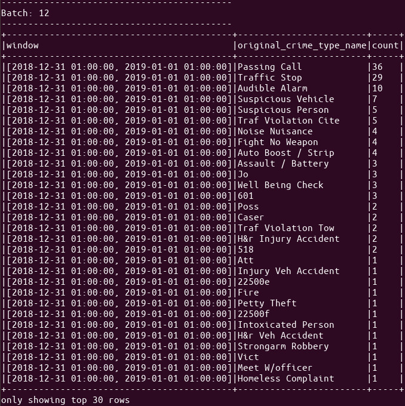
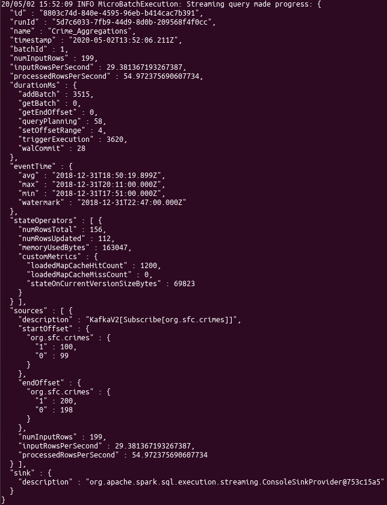
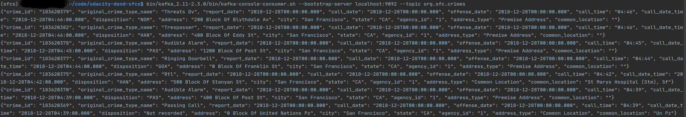

# San Francisco Crime Statistics 
Udacity Data Streaming Nanodegree

## Questions

### Question 1
How did changing values on the SparkSession property parameters affect the throughput and latency of the data?

- Changing parameters dramatically increased/decreased throughput and latency, depending on the parameters used.
- adding more cores in spark resulted in better throughput.
- increasing `maxOffsetsPerTrigger` had impact towards higher throughput 
- increasing `minPartitions` didn't improved throughput, changing values did'n't have a big impact. 
 

### Question 2
What were the 2-3 most efficient SparkSession property key/value pairs? Through testing multiple variations on values, 
how can you tell these were the most optimal?

  - I evaluated Spark options using the throughput-metric "processedRowsPerSecond" in the Progress reporter
  - Of the options I tested on my machine the most efficient where:
    - `master = local[6]`
    - `maxOffsetsPerTrigger = 300`
    - `minPartitions = 6`

## Screenshots 

### Spark UI

### Aggregated crimes stream

### Progress reporter

### Console consumer

## Run streaming application
1. run zookeeper `bin/kafka_2.11-2.3.0/bin/zookeeper-server-start.sh config/zookeeper.properties`
2. run kafka `bin/kafka_2.11-2.3.0/bin/kafka-server-start.sh config/kafka-server.properties`
3. run kafka_server.py `python kafka-server.py`
4. run spark data_stream.py `spark-submit --packages org.apache.spark:spark-sql-kafka-0-10_2.11:2.4.3 data_stream.py > tmp.log 2>&1`

## Sanity checks
- check if topic is created `bin/kafka_2.11-2.3.0/bin/kafka-topics.sh --bootstrap-server localhost:9092 --list`
- check if topic receives data `bin/kafka_2.11-2.3.0/bin/kafka-console-consumer.sh --bootstrap-server localhost:9092 --topic org.sfc.crimes --from-beginning`
- pyspark interactive console `pyspark --packages org.apache.spark:spark-sql-kafka-0-10_2.11:2.4.3`

 